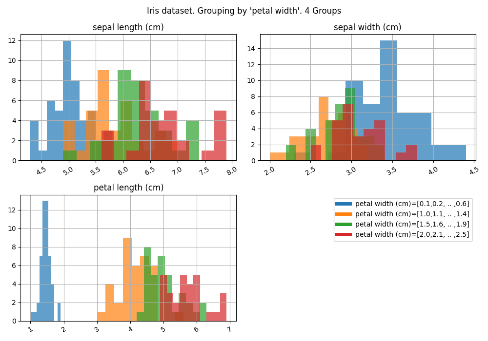
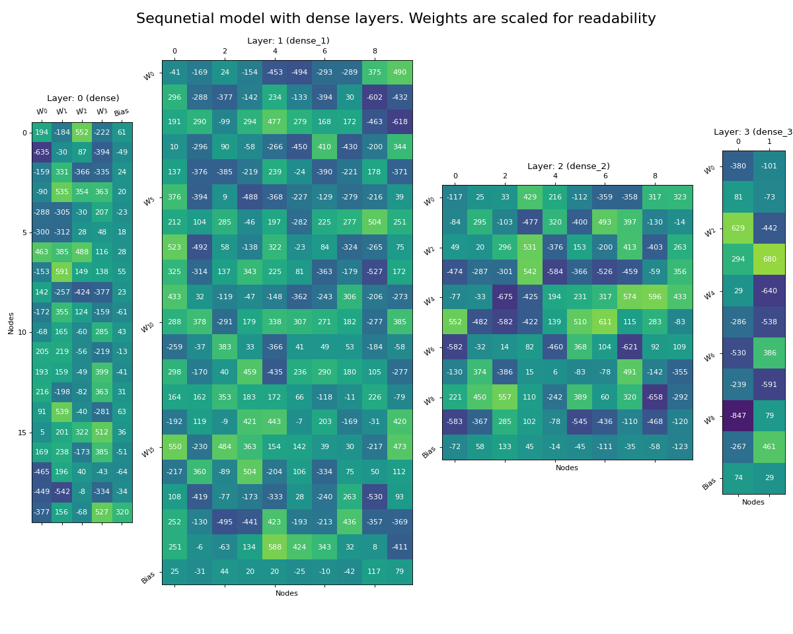

# Readme of `yasiu-vis`

High level functions, to quickly visualise data frames.

## Installation

```shell
pip install yasiu-vis
```
## Package Contains
- ykeras : Visualisation made for keras.Model
- ypandas: Visualisation made for pandas.DataFrame

### 

- `summary_plot` - plot dataframe, possible grouping by columns

#### Use example:

```py
from yasiu_vis.Ypandas import summary_plot


# df: pandas.DataFrame

summary_plot(df)
summary_plot(df, group="column-name")
summary_plot(df, group="column-name", split_widnow="column")
```
#### Example dataframe


```py
from yasiu_vis.ykeras import plotLayersWeights
from matpotlib import pyplot as plt
import keras

model : keras.models.Sequential # Keras compiled model

plotLayersWeights(model.layers)
plt.subplots_adjuts(wspace=0.1, top=0.95)
# Adjust values per model and plot size
plt.tight_layout()
# fit to figure
plt.show()
```

#### Example drawing



# All packages

[1. Native Package](https://pypi.org/project/yasiu-native/)

[2. Math Package](https://pypi.org/project/yasiu-math/)

[3. Image Package](https://pypi.org/project/yasiu-image/)

[4. Visualisation Package](https://pypi.org/project/yasiu-vis/)

